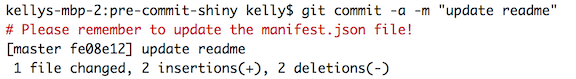
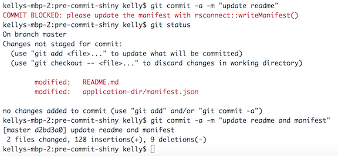

# Git Pre-Commit Hook Examples for RStudio Connect Deployments


## Basic examples

### Passive: Print a RED reminder message on every git commit

- Pros: Non-blocking
- Cons: Easily ignored

```
#!/bin/sh

tput setaf 1; echo "# Please remember to update the manifest.json file!"
tput sgr0
exit 0
```

**Example of a passive reminder message:**


### Active: Block any commit that does not include a modified manifest file

- Pros: Effective behavior modification
- Cons: Annoying, because not all commits truly require an update to the manifest file

```
#!/bin/sh

modified=`git status -s`
manifest=`git status -s | grep 'application-dir/manifest.json'`

if [ -n "$modified" ] &&  [ -z "$manifest" ]; then
    tput setaf 1; echo "COMMIT BLOCKED: please update the manifest with rsconnect::writeManifest()"
    tput sgr0
    exit 1
fi

exit 0
```

**Example of a blocked commit:**



## Application directory example

A less annoying, but still active blocking solution, is to modify the previous example such that only commits containing modifications to files in the application directory would be blocked.

- Pros: Commits to non-material files like `README.md` are not blocked by the manifest update requirement
- Cons: Requires setting up your project to use an application or content directory structure like the one used in this project

```
#!/bin/sh

if git diff --cached --name-only | grep --quiet "application-dir/"
then
  modified=`git status -s | grep 'M.*application-dir\/.*'`
  manifest=`git status -s | grep 'application-dir/manifest.json'`

  if [ -n "$modified" ] &&  [ -z "$manifest" ]; then
      tput setaf 1; echo "COMMIT BLOCKED: please update the manifest with rsconnect::writeManifest()"
      tput sgr0
      exit 1
  fi
fi

exit 0
```